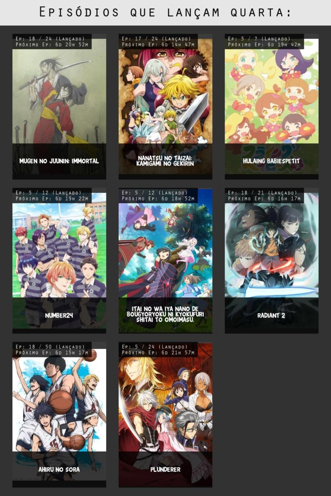
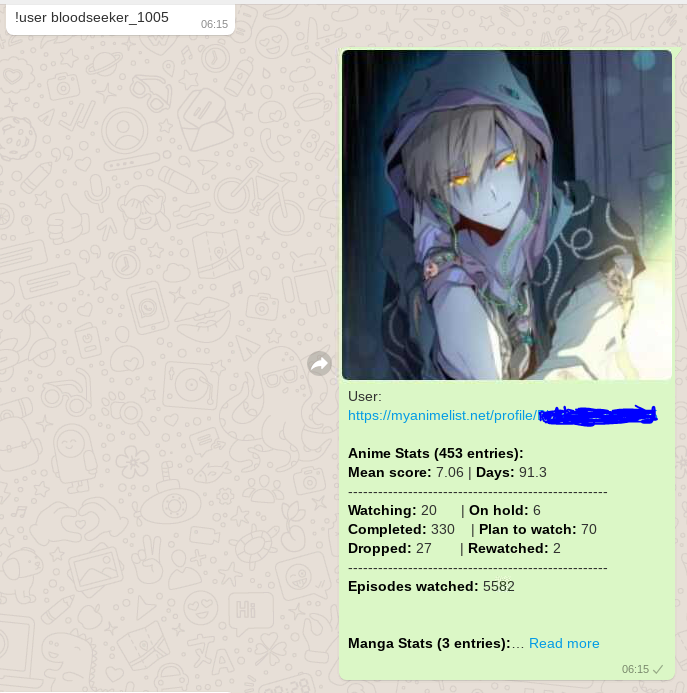

# Whatsapp MyAnimeList BOT
A MyAnimeList Bot that reacts to Whatsapp's chat commands, using selenium with javascript to send messages. At the moment with commands only in portuguese (Will add english later)

## Setup
You need python 3.6.x and above to use this, mainly because F-strings are used everywhere

### Translation API Setup
Currently, the bot translates the MyAnimeList, Anilist and MangaUpdates info with the google cloud translation tool directly to Portuguese, so if you need this functionality, create a folder named keys and add your translation api key in keys/key.json

If you for the time being does not need it, just replace the code in utils.py like the following
```
def translate(*texts): # Google
    os.environ['GOOGLE_APPLICATION_CREDENTIALS']='keys/key.json'
    translations = tr.Client().translate(
        list(texts), target_language='pt', 
        source_language='en', format_='text')
    return [translation['translatedText'] for translation in translations]
```
to
```
def translate(*texts): # Google
    return texts
```

### Modules Installation
After doing the translation setup, you need to install the required libraries, like the following
```pip install -r requirements.txt```

### Starting the bot
Run the bot with ```python main.py```, solve the Whatsapp's QR Code with your phone, then confirm it by pressing enter in the console.
You may need to install the chromedriver in your computer and add it to your PATH, you can download it from here https://chromedriver.storage.googleapis.com/index.html?path=84.0.4147.30/

## Available commands

### Portuguese
- **[ !help ]** - Mostra todos os comandos disponíveis no bot

- **[ !anime** _título_ **]** - Busca por um anime no MyAnimeList 
    - _!anime Shingeki no Kyojin_
   
- **[ !manga** _título_ **]** - Busca por um manga no MyAnimeList 
  - _!manga Shingeki no Kyojin_
  
- **[ !personagem** _título_ **]** - Busca por um personagem no MyAnimeList 
   - _!personagem Rem_
   
- **[ !monogatari ]** Mostra ordem das temporadas de monogatari 
---------------------------------------------------------------------------------------
- **[ !user ]** - Mostra comandos relacionados ao perfil do usuário
    - **[ !user** _usuário_ **]** - Mostra o perfil do MAL do usuário
        - _!user AltrianZ_
    - **[ !user perfil** _usuário_ **]** - Mostra o perfil do MAL do usuário
        -  _!user perfil AltrianZ_
    - **[ !user historico** _usuário_ **]** - Mostra histórico de update do usuário
        - _!user historico Yamashine_

- **[ !favorite ]** - Mostra os comandos que mostram os favoritos de um usuário no MAL
    - **[ !favorite anime** _usuário_ **]** - Mostra os animes favoritos do usuário
        - _!favorite anime DomGintoki_
    - **[ !favorite manga** _usuário_ **]** - Mostra os mangas favoritos do usuário
    - **[ !favorite personagem** _usuário_ **]** - Mostra os personagens favoritos do usuário
    - **[ !list ]** - Mostra comandos relacionados às listas de usuários do MAL

- **[ !semanal ]** - Mostra comandos relacionados a lançamentos de animes na semana
    - **[ !semanal [ontem, hoje, amanhã...] ]** - Mostra todos os animes que lançam ontem, hoje ou amanhã
    	- **tipos=** [antes de ontem, anteontem, hoje, amanhã, depois de amanhã]
        - _!semanal hoje, !semanal ontem_

    - **[ !semanal** dia **]** - Mostra todos animes lançados nesse dia
        -  _!semanal segunda_
    - **[ !semanal** anime **]** - Mostra em que dia da semana e a data de lançamento do anime
    - _**OBS: Além da palavra-chave semanal, também é possível usar !lançamento ou !semana**_

- **[ !top ]** - Mostra os comandos que mostram os tops do MyAnimeList, inclusive os top animes da temporada
    - **Geral:** **[ !top** tipo **]**
	    -  **tipos =** _anime, manga, pessoa, personagem_
	    -  _!top anime, !top manga..._
	
    - **Tops anime especificado:**
        - **[ !top anime** tipo **]**
        - **tipos =** _temporada, tv, filme, ova, pop, favorite_
        -  _!top anime temporada, !top anime pop..._

    - **Top manga especificado:**
        - **[ !top manga** tipo **]**
        - **tipos =** _manga, novel, oneshot, manhwa, manhua, pop, favorite_
        -  _!top manga manga, !top manga novel, !top manga manhwa..._
- **[ !list ]** - Mostra todos os comandos relacionados às listas de usuários no MyAnimeList
	- **Anime:**
		- **[ !list anime tipo** usuário **]**
		- **tipos =** _watching, completed, onhold, dropped, ptw_
		- **EX:** _!list anime dropped DomGintoki, !list anime ptw DomGintoki_
		- **_OBS: se não informar o tipo, a lista "watching" é mostrada por padrão_** 
			- _(!list anime DomGintoki)_
	- **Manga:**
		- **[ !list manga tipo** usuário **]**
		- **tipos =** _reading, completed, onhold, dropped, ptr_
		- **EX:** _!list manga completed DomGintoki, !list manga ptr DomGintoki_
		- **_OBS: se não informar o tipo, a lista "reading" é mostrada por padrão_** 
			- _(!list manga DomGintoki)_
--------------------------------------------------------------------------------------------------------
- **[ !contador help ]** - Mostra todos os comandos relacionados ao contador de mensagens e ranks
- **[ !contador]** - Mostra a contagem de mensagens semanal da pessoa e sua posição no ranking
- **[ !contador intervalo ]** - Mostra a contagem de mensagens da pessoa em um intervalo e seu ranking nele
	- **intervalos =** dia, semana, mês, all
	- _!contador, !contador dia, !contador mês..._
- **[ !contador rank, !rank, !ranking ]** - Mostra o ranking semanal do grupo.
- **[ !contador rank, !rank, !ranking** intervalo **]** - Mostra a contagem (de mensagens do grupo no intervalo indicado
	- **intervalos =** dia, semana, mês, all
	- _rank, !ranking dia, !contador rank mês..._
o **[!contador palavras]** - Mostra um resumo das palavras mais utilizadas, entre outras informações
- Obs: Para !contador e !contador palavras, é possível selecionar uma pessoa especifica do grupo usando @NomePessoa ou usando a posição da pessoa no ranking.
- !contador 1, !contador @Fredson Sumi, !contador palavras @Aki, !contador @JJ~ mês...


## App Demonstration
  

  


